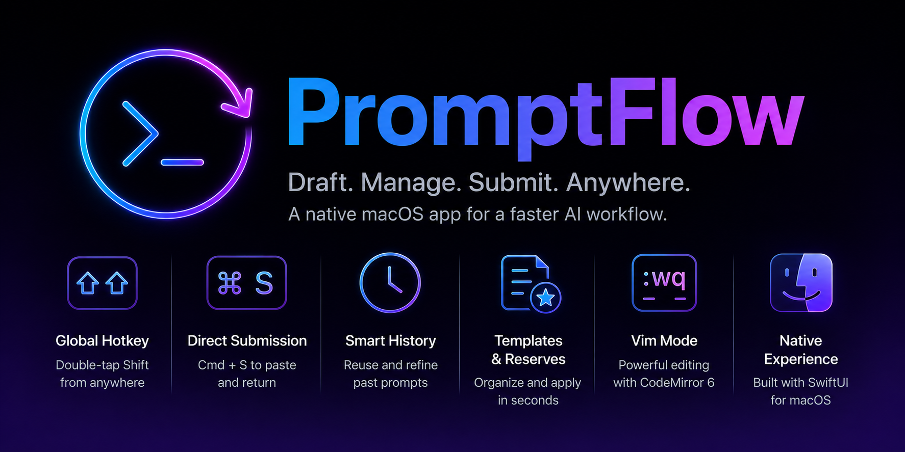

# PromptFlow

<!-- [APP_LOGO]: Placeholder for the app icon (128x128 or 256x256) -->

PromptFlow is a native macOS application designed to streamline the way you interact with AI agents. It serves as a dedicated workspace to draft, manage, and instantly submit prompts to any application on your Mac.

## Fast Workflow

PromptFlow is built for speed. Focus on your thoughts, not the UI:

1. **Invoke**: Double-tap **Shift** from any input field in any app to bring up PromptFlow.
2. **Draft**: Type your prompt in the clean, distraction-free editor.
3. **Submit**: Press **Cmd + S** to automatically return to your previous app and paste the prompt.

## Key Features

- **Global Hotkey Accessibility**: Open PromptFlow instantly from anywhere with a simple shortcut (default: double-tap **Shift**).
- **Direct Submission**: Seamlessly paste your prompts into the application you were just using with a single command.
- **Smart History**: Automatically tracks your past prompts, so you can reuse and refine them. Unsaved changes to Templates or Reserves are also backed up to history.
- **Templates & Reserves**: Organize frequently used prompt structures. Use search panels to find and apply them in seconds.
- **Vim Mode Support**: For power users, a full Vim keybinding mode is available, powered by CodeMirror 6.
- **Native Experience**: A clean, two-pane layout built with SwiftUI that respects macOS design patterns and system preferences.

<!-- [SCREENSHOT_MAIN]: Placeholder for the main window screenshot showing the two-pane layout with a prompt in the editor -->

## Keyboard Shortcuts

| Shortcut | Action |
| --- | --- |
| `Double Shift` | Open PromptFlow / Toggle back to target app |
| `Cmd + S` | **Submit**: Return to previous app and paste prompt |
| `Cmd + C` | **Copy**: Copy full prompt to clipboard |
| `Cmd + P` | **Previous History**: Select the previous (older) history item |
| `Cmd + N` | **Next History**: Select the next (newer) history item |
| `Cmd + T` | Open **Template Search** panel |
| `Cmd + R` | Open **Reserve Search** panel |
| `Cmd + E` | Focus the **Editor** |
| `Cmd + L` | Focus the **Sidebar List** |
| `Cmd + ,` | Open **Settings** |

<!-- [SCREENSHOT_SEARCH]: Placeholder for the Template Search panel showing real-time filtering -->

## Installation

1. Download the latest version from the [Releases](https://github.com/tokorom/PromptFlow/releases) page.
2. Drag **PromptFlow.app** to your `/Applications` folder.
3. Upon first launch, you will be prompted to grant **Accessibility** permissions. This is required for:
   - Detecting the previous application to enable "Submit".
   - Automatically pasting text into other apps.
   - Global hotkey detection.

## Configuration

In the **Settings** (`Cmd + ,`), you can customize:
- **Global Hotkey**: Change the double-tap trigger or set a custom combination.
- **Editor Settings**: Toggle Vim keybindings and Line Wrapping.
- **History**: Set the maximum number of history items to retain.
- **Storage**: Choose a custom folder to store your Templates and Reserves as plain `.txt` files for easy syncing or external editing.

---
*Created by Yuta Tokoro.*
